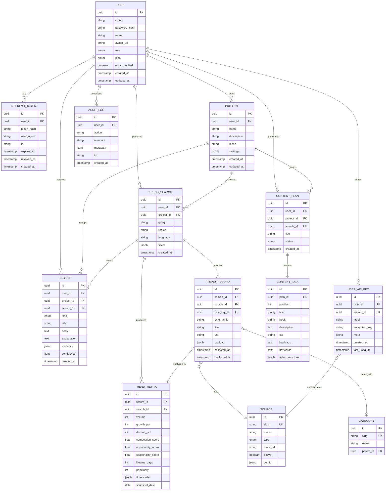

# Modelo Entidade-Relacionamento — ViralForge AI

## Diagrama (Mermaid)

## Tabelas Principais (Resumo)

| Tabela | Propósito |
|--------|-----------|
| `users` | Contas, perfil, plano, role |
| `refresh_tokens` | Tokens de rotação JWT |
| `projects` | Workspace do usuário (canal, marca) |
| `sources` | Fontes de dados configuráveis (Google, YT, Reddit…) |
| `trend_searches` | Pesquisas executadas pelos usuários |
| `trend_records` | Tendências brutas coletadas |
| `trend_metrics` | Métricas calculadas (crescimento, concorrência…) |
| `categories` | Taxonomia |
| `insights` | Insights gerados pela IA |
| `content_plans` | Planos de conteúdo |
| `content_ideas` | 20 ideias por plano |
| `user_api_keys` | Chaves criptografadas dos usuários |
| `audit_logs` | Auditoria |

## Índices Estratégicos

- `trend_records(source_id, collected_at DESC)` — séries temporais
- `trend_records(title gin_trgm_ops)` — busca por similaridade
- `trend_metrics(snapshot_date, record_id)` — analytics rápidos
- `insights(user_id, created_at DESC)` — feed
- `audit_logs(user_id, created_at DESC)` — auditoria
